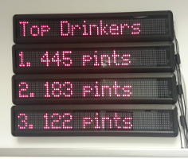

# MultiMovingsign

Command line tool to drive multiple [`movingsign_api`](https://github.com/webmonarch/movingsign_api) compatible [LED signs](http://www.signsdirect.com/Home/LED-Signs-Programmable/7x80-LED-Indoor-Brightness-Sign-Red.html) in unison.

For example: (below) `multi_movingsign` being used to display [Kegbot ](https://kegbot.org) top drinker stats.




# Why?

It's a fun, low-fi way to display various things.  Some examples:

* Business Stats
  * Sales
  * Revenue
  * Users
* Social
  * Tweets
  * Facebook Wall
* [Kegbot!](https://kegbot.org)
  * Keg Status
  * Drinker Stats
* Pretty much anything!


# Components

This gem comprises of the following main features:

* A command line tool `multi_movingsign` (see `multi_movingsign help` or [cli.rb](lib/multi_movingsign/cli.rb))
* CLI for individual operations
  * setup + configuration
  * displaying a page of information on screen
* A server mode to continuously alternate between pages of information (see `multi_movingsign server help` or [server.rb](lib/multi_movingsign/server.rb))
  * `server start`
  * `server add-page`
      * adds/updates a page on display rotation
  * `server alert`
      * send a page to be display immediately (on demand) and not put into rotation
  * `server stop`

To get help on the CLI tools, run help:

``` bash
$ multi_movingsign help
  Commands:
    multi_movingsign help [COMMAND]             # Describe available commands or one specific command
    multi_movingsign server SUBCOMMAND ...ARGS  # Run or manipuate the MultiMovingsign server
    multi_movingsign settings                   # Prints settings to terminal
    multi_movingsign setup                      # Setup available Movingsign LED signs and preferences
    multi_movingsign show-identity              # Show sign identifying information on all signs
    multi_movingsign show-page --page=PAGE      # Renders the specified page to the configured signs

  Options:
    [--rc=RC]  # Path the persistent settings file. Defaults to: ~/.multi_movingsign.yml
```

# Getting Started

## Requirements

To use the `multi_movingsign` gem,  you need:

* 2 - 4 `movingsign_api` LED signs
  * More signs possible...just not tested
* Ruby >= 2.0.0 Recommended
  * Ruby 1.9.3 is also tested
* UNIX-y OS (Linux, Mac)
  * Windows *may* work, but not tested

## Installation

Add this line to your application's Gemfile:

    gem 'multi_movingsign'

And then execute:

    $ bundle

Or install it yourself as:

    $ gem install multi_movingsign

## Usage

The workflow is as follows:

1. Configure `multi_movingsign` with the attached LED sign device paths
2. Create a page of information to display (see [page definition](PAGE_DEFINITION.md))
3. Start the MultiMovingsign server
4. Add the page to the server
5. Stop the server

``` bash
$ multi_movingsign setup --signs /dev/ttyUSB0 /dev/ttyUSB1      # Setup the sign device paths

$ cat > page.yml <<PAGE                                         # Create page definition in page.yml
---
title: Page Title
lines:
- prefix: 'L 1: '
  content:
  - Screen 1
  - Screen 2
- prefix: 'L 2: '
  content:
  - Screen 1
  - Screen 2
PAGE

$ multi_movingsign server start                                 # Start the sign server

$ multi_movingsign server add-page --page page.yml              # Add a page to the running server (do in a separate terminal window from the 'server start' above)

$ multi_movingsign server stop                                  # Stop the server
```

For examples on using `multi_movingsign` programmatically, see [cli.rb](lib/multi_movingsign/cli.rb).

## Version History

For a complete list of versions, see [CHANGELOG.md](CHANGELOG.md).


# Contributing

1. Fork it
2. Create your feature branch (`git checkout -b my-new-feature`)
3. Commit your changes (`git commit -am 'Add some feature'`)
4. Push to the branch (`git push origin my-new-feature`)
5. Create new Pull Request
